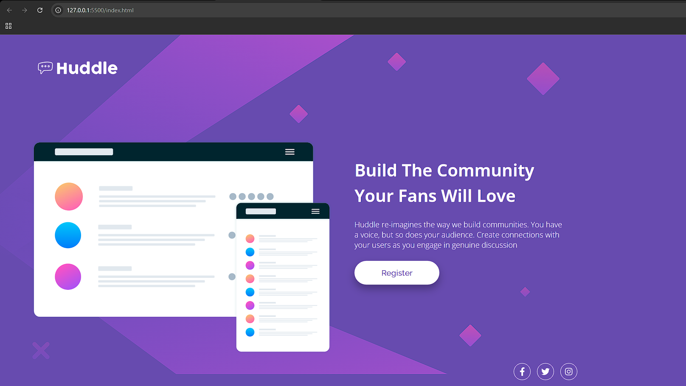
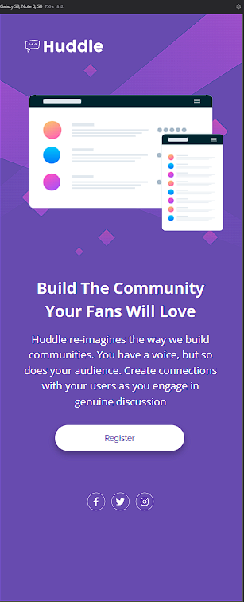

# Índice

- [Visão geral](#visão-geral)
- [O desafio](#o-desafio)
- [Captura de tela](#captura-de-tela)
- [Links](#links)
- [Construído com](#construído-com)
- [Autor](#autor)

## Visão geral

Utilizar o style.cd e arquivos de design do layout fornecidos para executar o projeto de forma mais fiél possível, utilizando Flexbox para posicionamento dos elementos no layout.

### O desafio
"Quest HTML + CSS avançado

ATENÇÃO: LEIAM O ARQUIVO STYLE-GUIDE.MD PARA INSTRUÇÕES DE COMO COMEÇAR O PROJETO 

Use os conhecimentos que aprendeu nos módulos de HTML avançado e CSS avançado para resolvê-lo da melhor forma."

### Captura de tela

# Desktop

# Mobile

### Links

- URL da solução: [https://github.com/PietroZanetelliDev/quest-html-css-huddle-project-base](https://github.com/PietroZanetelliDev/quest-html-css-huddle-project-base)
- URL do site ativo: [https://pietrozanetellidev.github.io/quest-html-css-huddle-project-base/](https://pietrozanetellidev.github.io/quest-html-css-huddle-project-base/)

### Construído com

- Marcação HTML5 semântica
- Propriedades personalizadas CSS
- Flexbox
- CSS Flex

## Autor
- GitHub - [PietroZanetelliDev](https://github.com/PietroZanetelliDev)
